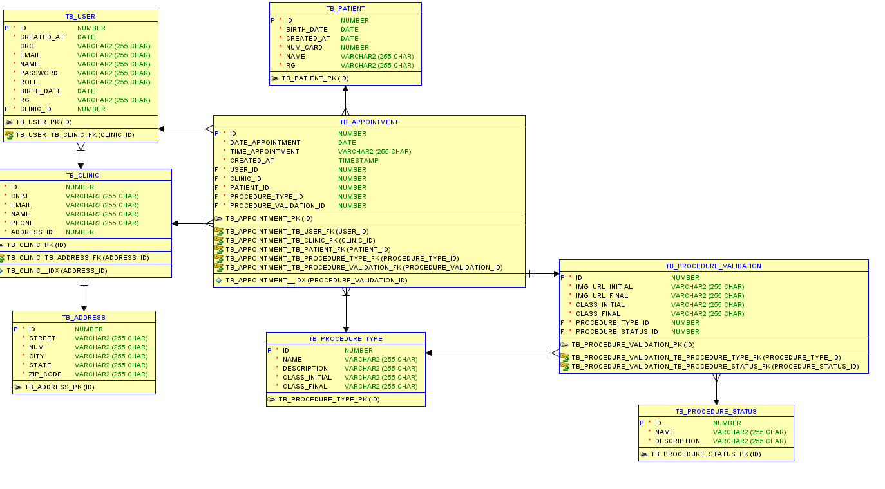

# Odonto Validation

Serviço de Validação de Consultas Odontológicas

### Link p/ apresentação da solução: https://www.youtube.com/watch?v=wJah-rw1eGQ&ab_channel=Kau%C3%A3Silveira

## Integrantes do Grupo

### Kauã Almeida Silveira

- **Responsável por:** API em Java Spring Boot, integração com o banco de dados Oracle, e API Python com Roboflow para
  visão computacional.

### Rafael Vida

- **Responsável por:** DevOps no Azure e QA, garantindo o pipeline de integração contínua e a qualidade do software.

### Gustavo Maia

- **Responsável por:** Desenvolvimento do App em Kotlin para Android e site em C#.

### ENTREGA DEVOPS INSTRUÇÕES

## AVISO IMPORTANTE - DEVOPS - ESTE PROJETO ESTÁ FUNCIONANDO PERFEITAMENTE NO AZURE

## E A API ESTÁ FUNCIONANDO E SE COMUNICANDO COM REQUISIÇÕES DE QUALQUER LUGAR

## O BANCO DE DADOS ORACLE ESTÁ HOSPEDADO EM UM SERVIDOR REMOTO DA FIAP

## TUDO ESTÁ FUNCIONANDO PERFEITAMENTE !!!

- Construimos uma Dockerfile para a aplicação Spring Boot, e a aplicação foi dockerizada e publicada no Docker Hub.
- Na vm do Azure, foi logado no Docker Hub e a imagem foi baixada e rodada.
- Configuramos o Azure para liberar a porta 8080 para a aplicação Spring Boot.

## Como testar a aplicação

- O link para a aplicação rodando no Azure é: http://191.232.33.242:8080
- Para testar a aplicação, é necessário utilizar o Postman e importar a coleção de requisições.
- Exemplo de requisição: http://191.232.33.242:8080/clinics
- A coleção de requisições está no arquivo `ChallengeOdontoPrev.postman_collection.json` na pasta raiz do projeto.
- A environment do Postman está no arquivo `auth.postman_environment` na pasta raiz do projeto.
- Para testar a aplicação, é necessário realizar o login e obter o token JWT, e inseri-lo no Authorization das
  requisições, como bearer token.
- A aplicação está rodando no Azure, e o banco de dados Oracle está hospedado em um servidor remoto da FIAP.

## Instruções para Rodar a Aplicação

## Pré-requisitos para rodar a API Spring Boot:

- Java 17 ou superior instalado (para a API Spring Boot)
- Maven instalado (para a API Spring Boot)
- As configurações do banco de dados Oracle estão no arquivo `application.properties` na pasta `src/main/resources`,
  não é necessário instalar o banco de dados Oracle, pois a aplicação está utilizando um banco de dados disponibilizado
  em um servidor remoto da FIAP.

## Passo a Passo:

1. **Clone o repositório:**
   ```git clone https://github.com/ChallengeOdontoPrev/javaAdvanced.git```
2. **Acesse a pasta do projeto no intellij:**
   ```javaAdvanced/odontoprev```
3. **Defina o JDK no Intellij para Run & build do projeto**
4. **Rode a aplicação Spring Boot, localizada na pasta raiz**
   ```OdontoPrevApplication.java```

## Como testar a API Spring Boot:

1. **Importe o arquivo de coleção do Postman:**
   ```ChallengeOdontoPrev.postman_collection.json```
2. **Importe o arquivo de ambiente do Postman:**
   ```auth.postman_environment.json```
3. **Execute as requisições do Postman para testar a API**

## Endpoints da API Spring Boot:

Observação: Vale ressaltar que a API Spring Boot está utilizando
Spring Security com JWT para autenticação e autorização. Logo, é necessário
realizar o login para obter o token JWT e inseri-lo no Authorization das requisições, de todos recursos, como bearer
token.

### Autenticação (`/auth`)

- **POST** `/auth/login`  
  **Descrição:** Realiza login e retorna um token de autenticação.
  ```json
  {
    "email": "kaua.silveira@gmail.com",
    "password": "kaua2011"
  }

- **POST** `/auth/signup`  
  **Descrição:** Cria uma nova conta para um usuário.
  ```json
  {
    "email":"kauiis.a.silveira@gmail.com",
    "password":"kaua123",
    "name":"kaua",
    "rg":"52415678578",
    "birthDate":"2004-11-20",
    "role":"DENTISTA",
    "cro":"48567584",
    "clinicId":201
  }
  ```

- **POST** `/auth/forgot-password`

  **Descrição:** Envia um e-mail para redefinição de senha.

  **Query Params:**
  email: E-mail do usuário que deseja redefinir a senha.
  Exemplo: /auth/forgot-password?email=ti.kaua.silveira@drummond.com.br


- **POST** `/auth/reset-password`

  **Descrição:** Redefine a senha do usuário com base no token de autenticação.

  **Query Params:**

  **token:** Token JWT recebido no e-mail.

  **newPassword:** Nova senha.

  **confirmNewPassword:** Confirmação da nova senha.

  **Exemplo:** /auth/reset-password?token=<jwt_token>&newPassword=kk&confirmNewPassword=kk

- **GET** `/auth?role=DENTISTA`

  **Descrição:** Retorna a lista de usuarios com a role DENTISTA.

### Clínicas (`/clinics`)

- **GET** `/clinics`

  **Descrição:** Retorna a lista de clínicas disponíveis.

- **POST** `/clinics`

  **Descrição:** Insere uma nova clínica.
    ```json
    {
        "name":"Clinica Odonto Alvorada",
        "cnpj":"9785461/546164-78",
        "address": {
            "street":"Rua pacheco",
            "number":"92",
            "city":"São Paulo",
            "state":"SP",
            "zipCode":"03728-064"
        },
        "phone":"11 975122387",
        "email":"OdontoAlvoradas@gmail.com"
    }

### Pacientes (`/patients`)

- **GET** `/patients`

  **Descrição:** Retorna a lista de pacientes cadastrados.

- **GET** `/patients/{rg}`

  **Descrição:** Retorna o paciente pelo rg.

- **POST** `/patients`

  **Descrição:** Insere um novo paciente.
    ```json
    {
        "name": "Kaua Almeida",
        "rg": "758924780",
        "birthDate": "2004-11-20",
        "numCard": 7852145
    }

- **POST** `/patients/withProcedure`

  **Descrição:** Insere um novo paciente porém utilizando procedure do banco.
    ```json
    {
        "name": "Kaua Almeida",
        "rg": "758924780",
        "birthDate": "2004-11-20",
        "numCard": 7852145
    }

- **DELETE** `/patients/withProcedure/{id}`

  **Descrição:** Deleta o paciente pelo id usando procedure.

- **PUT** `/patients/withProcedure`

  **Descrição:** Atualiza o paciente inteiro pelo id usando procedure.
    ```json
    {
        "id":23,
        "name": "Kaua Almeida",
        "rg": "758924780",
        "birthDate": "2004-11-20",
        "numCard": 7852145
    }

### Consultas (`/appointments`)

- **GET** `/appointments`

  **Descrição:** Retorna todas as consultas agendadas.

- **GET** `/appointments/status?status=Reagendada`

  **Descrição:** Retorna todas as consultas agendadas com status passado.

- **GET** `/appointments/{id}`

  **Descrição:** Retorna uma consulta a partir do seu id passado como PathVariable

- **DELETE** `/appointments/{id}`

  **Descrição:** Deleta uma consulta a partir do seu id passado como PathVariable

- **POST** `/appointments`

  **Descrição:** Cria uma nova consulta.
    ```json
    {
        "dateAppointment": "2024-10-01",
        "timeAppointment": "14:30",
        "dentistId": 1,
        "patientId": 1,
        "procedureTypeId": 1
    }

### Tipos de Procedimentos (`/proceduresType`)

- **GET** `/proceduresType`

  **Descrição:** Retorna os tipos de procedimentos disponíveis.

- **POST** `/proceduresType`

  **Descrição:** Insere um tipo de procedimento.
    ```json
    {
        "name":"Instalação de Aparelho dental",
        "description":"Instalação de Aparelho dental na arcada dentaria"
    }

### Status do Procedimento (`/proceduresStatus`)

- **GET** `/proceduresStatus`

  **Descrição:** Retorna os status de procedimentos disponíveis.

- **POST** `/proceduresStatus`

  **Descrição:** Insere um status de procedimento.
    ```json
    {
        "name":"VALIDADO",
        "description":"VALIDADO"
    }

- **POST** `/proceduresStatus/withProcedure`

  **Descrição:** Insere um status de procedimento porém utilizando procedure do banco.
    ```json
    {
        "name":"VALIDADO",
        "description":"VALIDADO"
    }

- **DELETE** `/proceduresStatus/withProcedure/{id}`

  **Descrição:** Deleta o status de procedimento pelo id usando procedure.

- **PUT** `/proceduresStatus/withProcedure`

  **Descrição:** Atualiza o status de procedimento inteiro pelo id usando procedure.
    ```json
    {
        "id":14,
        "name":"Reagendada",
        "description":"Nova descrição"
    }

### Validação do Procedimento (`/proceduresValidation`)

- **GET** `/proceduresValidation`

  **Descrição:** Retorna as validações de procedimentos.

- **PATCH** `/proceduresValidation/{id}?status=VALIDADO`

  **Descrição:** Atualiza o status de validação de um procedimento, a partir do id passado
  como PathVariable e o status por RequestParam.

## Diagrama de Entidade-Relacionamento (DER)


